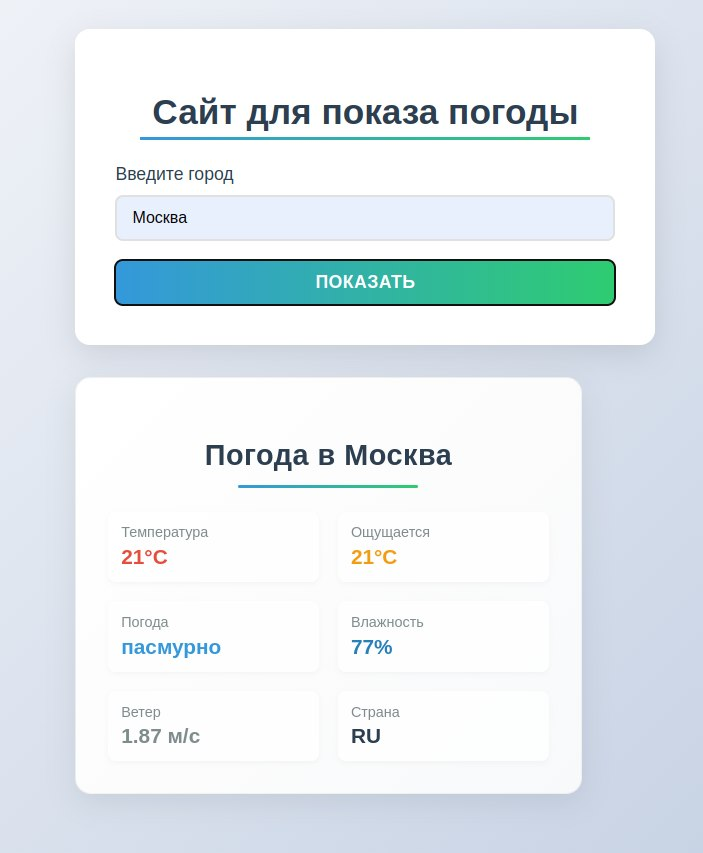

# Weather App - Показывает погоду в городе

## 🚀 Быстрый старт

## Скриншоты приложения

### Главный экран


### Демонстрация работы



### Предварительные требования
- [Node.js](https://nodejs.org/) v18+
- [Docker](https://www.docker.com/)
- [Git](https://git-scm.com/)

### Установка
```bash
git clone https://github.com/1234445666666/Weather
cd Weather
npm install
```

## 🛠 Разработка
```bash
npm run dev
```
Приложение будет доступно по адресу: [http://localhost:3000](http://localhost:3000)

## 🐳 Docker-развертывание

### 1. Сборка и запуск
```bash
docker build -t weather .
docker run -d -p 80:80 --name weather-app weather
```
Приложение будет доступно: [http://localhost](http://localhost)

### 2. Остановка контейнера
```bash
docker stop weather-app
```

## 📁 Структура проекта
```
Weather/
├── src/               # Исходный код
├── dist/              # Production-сборка (генерируется)
├── Dockerfile         # Конфигурация Docker
├── nginx.conf         # Настройки Nginx
└── vite.config.js     # Конфиг Vite
```

## ⚙️ Настройки Nginx
Файл `nginx.conf`:
```nginx
server {
    listen 80;
    location / {
        root /usr/share/nginx/html;
        index index.html;
        try_files $uri $uri/ /index.html;
    }
}
```

## 🔧 Устранение проблем
Если возникает ошибка:
```bash
COPY failed: stat app/dist: file does not exist
```
1. Убедитесь, что `npm run build` генерирует папку `dist/`
2. Проверьте пути в `Dockerfile`:
   ```dockerfile
   COPY --from=builder /app/dist /usr/share/nginx/html
   ```
